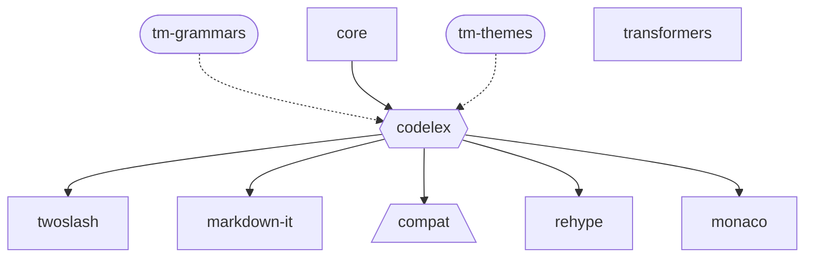

# Contributing Guide

Thanks for lending a hand 👋

## Development

### Setup

- We use [pnpm](https://pnpm.js.org/) to manage dependencies. Install it with `npm i -g pnpm`.
- Install dependencies with `pnpm i`.
- Build all packages with `pnpm build`.

### Packages Structure

- `core` contains the core logic of Codelex, without any languages/themes prebundled. Published as `@codelexjs/core`.
- `codelex` is the main package that bundles languages/themes from [`tm-grammars`](https://github.com/deepcode-ai/textmate-grammars-themes) and [`tm-themes`](https://github.com/deepcode-ai/textmate-grammars-themes) for easier usage. Published as `codelex`.
- `compat` contains the compatibility layer for Codelex v0.x. Published as `@codelexjs/compat`.
- `transformers` contains common transformers for Codelex. Published as `@codelexjs/transformer`.
- The rest of the packages are high-level integrations on top of `codelex`.

### Testing

- We use [Vitest](https://vitest.dev) to test the codebase. Run `pnpm test` to start the test runner.
- We have quite some [Snapshot Tests](https://vitest.dev/guide/snapshot.html) to ensure the output is consistent. If you are making changes to the output, run `pnpm test -u` to update the snapshots.

### Coding conventions

- We use ESLint to lint and format the codebase. Before you commit, all files will be formatted automatically.
- We use [Conventional Commits](https://www.conventionalcommits.org/en/v1.0.0/). Please use a prefix. If your PR has multiple commits and some of them don't follow the Conventional Commits rule, we'll do a squash merge.
